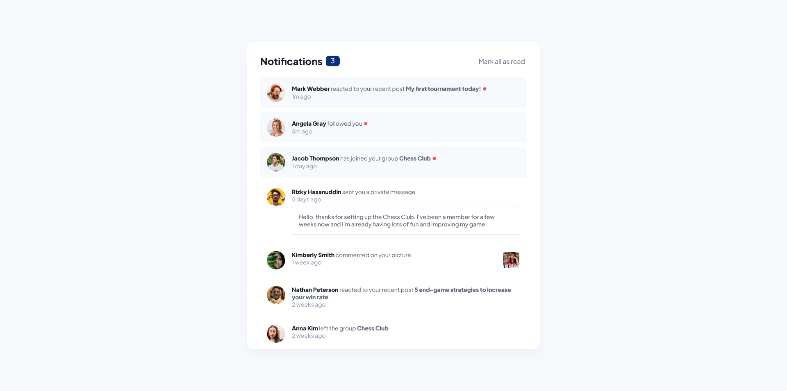

# Frontend Mentor - Notifications page solution

This is a solution to the [Notifications page challenge on Frontend Mentor](https://www.frontendmentor.io/challenges/notifications-page-DqK5QAmKbC).

## Table of contents

- [Overview](#overview)
  - [The challenge](#the-challenge)
  - [Screenshot](#screenshot)
  - [Links](#links)
- [My process](#my-process)
  - [Built with](#built-with)
  - [What I learned](#what-i-learned)
  - [Continued development](#continued-development)
- [Author](#author)
- [Acknowledgments](#acknowledgments)

## Overview

### The challenge

Users should be able to:

- Distinguish between "unread" and "read" notifications
- Select "Mark all as read" to toggle the visual state of the unread notifications and set the number of unread messages to zero
- View the optimal layout for the interface depending on their device's screen size
- See hover and focus states for all interactive elements on the page

As an extra, the notifications can also be set to read individually by clicking on the unread notification in question.

### Screenshot



### Links

- Solution URL: [https://github.com/cwatso/notifications-page](https://github.com/cwatso/notifications-page)
- Live Site URL: [https://cwatso.github.io/notifications-page](https://cwatso.github.io/notifications-page)

## My process

### Built with

- React (https://reactjs.org/) - JS library
- Vite (https://vitejs.dev/)
- SCSS
- Mobile-first workflow

### What I learned

This was my first project created using Vite. For the most part it was fairly straight forward, but there were definitely some quirks I encountered.

Each notification's avatar is generated using a component. In order to generate the correct URL for avatar images from the props passed to the component (first and last name) I needed to create a function that would make use of import.meta.url and URL constructor.

```tsx
function getImageURL(fragment: string | null) {
  const fragmentString: string = fragment || "";
  return new URL(fragmentString, import.meta.url).href;
}
```

Tapas Adhikary's video on importing images dynamically (https://www.youtube.com/watch?v=7EFZIe_Cpv8) was a great help here and I followed his suggestion of making this a seperate utility. This allowed for the same function to be used for any photo notifications where the photo thumbnail needed to be displayed.

I struggled to import the variable jakarta font using the usual font face method. The path after build would not be correct despite trying several different methods. This is definitely something I will continue to research and attempt to improve upon in the future, but for the sake of simplicity this time I switched to importing from google.

### Continued development

I will be paying close attention to file structure and how Vite processes urls with the goal of being able to correctly import hosted fonts. Variable fonts and their custom properties could also provide some additional polish to future projects.

## Author

- Website - [Clare Watson](https://www.clarewatson.com)
- Frontend Mentor - [@cwatso](https://www.frontendmentor.io/profile/cwatso)
